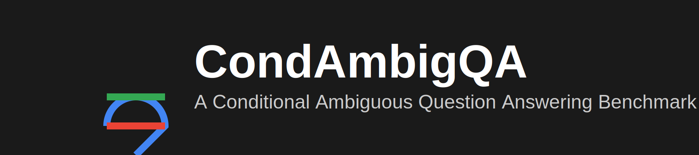

# 

🏠 [项目主页](https://github.com/innovation64/CondAmbigQA) | 📝 [论文](https://arxiv.org/abs/2502.01523) | 🤗 [数据集](https://huggingface.co/datasets/Apocalypse-AGI-DAO/CondAmbigQA) | 🆕 [CondAmbigQA-2K](https://huggingface.co/datasets/Apocalypse-AGI-DAO/CondAmbigQA-2K) | 📊 [实验结果](#实验结果与性能分析) | 🌍 [English](./README.md)

🔄 支持RAG、LLMs、基于条件的问答

💫 一个通过条件识别来解决歧义问题的新型基准测试

## 📌 CondAmbigQA: 条件性歧义问答基准测试

- 📚 最新消息
  - 🆕 **CondAmbigQA-2K 数据集**: [Hugging Face](https://huggingface.co/datasets/Apocalypse-AGI-DAO/CondAmbigQA-2K) - 扩展的2,000样本数据集
  - 🎉 原始数据集发布: [Hugging Face](https://huggingface.co/datasets/Apocalypse-AGI-DAO/CondAmbigQA)
  - 📄 论文发布: [arXiv](https://arxiv.org/abs/2502.01523)

- 🚀 快速开始
  - [安装配置](#安装配置)
  - [数据集使用](#数据集使用)
  - [模型评估](#模型评估)
  - [标注系统](#标注系统)
  - [实验代码](#实验代码)

## 💡 快速开始

### 基础数据集使用

#### 原始 CondAmbigQA 数据集
```python
from datasets import load_dataset
dataset = load_dataset("Apocalypse-AGI-DAO/CondAmbigQA")
```

#### 扩展 CondAmbigQA-2K 数据集（2,000 样本）
```python
from datasets import load_dataset
dataset_2k = load_dataset("Apocalypse-AGI-DAO/CondAmbigQA-2K")
```

### 运行实验

```bash
# 运行主实验（带检索增强）
cd experiment_code/core
python main_experiment.py

# 运行标注系统
cd annotation-system
python main.py --input data/questions.json --output data/annotated.json
```

## 🏗️ 项目组件

### 📁 目录结构

```
CondAmbigQA/
├── annotation-system/     # AI-AI 标注系统
├── experiment_code/       # 实验评估代码
├── retrieval/            # 文档检索组件
├── label/               # 标注工具
└── results/             # 实验结果与可视化
```

### 📝 标注方法体系

**主要方法**: **人机协作标注**（论文中描述的方法）
- 专家人工标注员配合AI辅助
- 人工质量控制和验证
- 基于人类判断的迭代优化

**辅助工具**: **AI-AI预标注系统**
- **⚠️ 仅为辅助工具** - 需要人工验证
- 自动化初步标注生成
- 8维度质量评估用于问题标记
- 增强型多智能体协作，集成GPT-4o
- **工作流程**: AI-AI预标注 → **人工专家审查** → 最终标注

### 🧪 实验代码
- **多模型支持**: OpenAI API 和本地 Ollama 模型
- **综合评估**: 多维度评分系统
- **丰富的可视化**: 统计分析和对比图表
- **灵活配置**: 便于调整模型和参数

## 📋 安装配置

### 环境要求
- Python 3.7+
- OpenAI API密钥（GPT模型）
- Ollama（本地模型）

### 安装步骤
```bash
# 克隆仓库
git clone https://github.com/innovation64/CondAmbigQA.git
cd CondAmbigQA

# 安装主要依赖
pip install -r requirements.txt

# 标注系统依赖
cd annotation-system
pip install -r requirements.txt

# 实验代码依赖
cd experiment_code
pip install -r requirements.txt
```

### 环境配置
```bash
# OpenAI模型配置
export OPENAI_API_KEY="your_api_key"

# 确保Ollama运行中（本地模型）
# 默认地址: localhost:11434
```

## 📖 数据集使用

### 加载数据集

#### 原始 CondAmbigQA 数据集
```python
from datasets import load_dataset
dataset = load_dataset("Apocalypse-AGI-DAO/CondAmbigQA")
```

#### 扩展 CondAmbigQA-2K 数据集（2,000 样本）
```python
from datasets import load_dataset
dataset_2k = load_dataset("Apocalypse-AGI-DAO/CondAmbigQA-2K")
```

### 数据结构
```json
{
  "id": "唯一标识",
  "question": "歧义问题",
  "properties": [
    {
      "condition": "条件描述",
      "groundtruth": "该条件下的答案",
      "condition_citations": [...],
      "answer_citations": [...]
    }
  ],
  "ctxs": [{"title": "...", "text": "..."}]
}
```

## 🔬 模型评估

### 支持的模型
- **OpenAI**: GPT-4o, GLM-4-plus
- **本地 Ollama**: Llama3.1:8b, Qwen2.5, Mistral, Gemma2, GLM4, DeepSeek-R1

### 运行实验
```bash
# 主实验（带检索增强）
cd experiment_code/core
python main_experiment.py

# 纯LLM实验（无检索）
python pure_llm_experiment.py

# 基准标注实验
python ground_truth_experiment.py
```

### 可视化分析
```bash
cd experiment_code/visualization
python main_visualizer.py          # 综合分析
python comparison_visualizer.py    # 实验对比
python statistics_visualizer.py    # 统计分析
```

## 📊 实验结果与性能分析

### 🏆 主实验结果（带检索增强）

| 模型 | 类型 | 条件分数 | 答案分数 | 引用分数 | 综合分数 | 排名 |
|-------|------|----------------|-------------|----------------|----------------|------|
| **GPT-4o** | API | **0.552 ± 0.190** | **0.558 ± 0.157** | **0.875 ± 0.207** | **0.662** | 🥇 #1 |
| **GLM4-plus** | API | 0.302 ± 0.069 | 0.420 ± 0.097 | 0.441 ± 0.261 | 0.388 | 🥈 #2 |
| **Qwen2.5** | 本地 | 0.235 ± 0.120 | 0.287 ± 0.161 | 0.558 ± 0.359 | 0.360 | 🥉 #3 |
| **DeepSeek-R1** | 本地 | 0.245 ± 0.112 | 0.293 ± 0.142 | 0.501 ± 0.342 | 0.346 | #4 |
| GLM4 | 本地 | 0.231 ± 0.071 | 0.290 ± 0.090 | 0.320 ± 0.215 | 0.280 | #5 |
| LLaMA3.1 | 本地 | 0.232 ± 0.076 | 0.252 ± 0.093 | 0.306 ± 0.246 | 0.264 | #6 |
| Mistral | 本地 | 0.196 ± 0.060 | 0.231 ± 0.079 | 0.263 ± 0.214 | 0.230 | #7 |
| Gemma2 | 本地 | 0.170 ± 0.091 | 0.203 ± 0.118 | 0.217 ± 0.277 | 0.197 | #8 |
| **平均** | - | **0.270** | **0.317** | **0.435** | **0.341** | - |

### 📈 综合性能分析

| 模型类型 | 纯LLM（平均答案分数） | 模型生成条件 | 基准条件 | 提升幅度 |
|------------|------------------------------|-------------------------------|------------------|-------------|
| **专有模型** | | | | |
| **GPT-4o** | **0.25** | **0.56** | **0.57** | **+128%** |
| GLM4-plus | 0.24 | 0.42 | 0.53 | +121% |
| **本地模型** | | | | |
| Qwen2.5 | 0.15 | 0.29 | 0.40 | +167% |
| Mistral | 0.17 | 0.23 | 0.29 | +61% |
| Gemma2 | 0.15 | 0.20 | 0.29 | +93% |
| LLaMA3.1 | 0.14 | 0.25 | 0.29 | +107% |
| GLM4 | 0.14 | 0.29 | 0.38 | +171% |
| **DeepSeek-R1** | 0.07 | 0.29 | 0.34 | **+400%** |
| **平均** | **0.164** | **0.316** | **0.386** | **+135%** |

### 🎯 关键性能洞察

#### 🚀 主实验（RAG）性能
- **明显优胜者**: **GPT-4o** 在所有指标上都表现优异，综合分数0.662
  - **引用卓越**: 0.875引用分数（远超其他模型）
  - **平衡表现**: 在条件理解（0.552）、答案准确性（0.558）和引用质量上都很强

- **API vs 本地模型差距**: 
  - **API模型**: GPT-4o (0.662), GLM4-plus (0.388)
  - **最佳本地模型**: Qwen2.5 (0.360) - 与API模型竞争力相当
  - **本地模型范围**: 0.197 (Gemma2) 到 0.360 (Qwen2.5)

- **引用性能层次**:
  - **第一层**: GPT-4o (0.875) - 卓越的引用质量
  - **第二层**: Qwen2.5 (0.558), DeepSeek-R1 (0.501) - 良好的引用能力
  - **第三层**: 其他模型 (0.217-0.441) - 中等引用能力

#### 📊 跨实验分析
- **条件信息的显著改进**: 所有模型在提供条件信息时都表现出大幅性能提升
  - **DeepSeek-R1**: 最显著的改进（+400%，从纯LLM的0.07到条件性的0.34）
  - **平均改进**: 所有模型平均提升+135%
  - **本地模型**: 比专有模型显示出更高的改进率

- **性能一致性**:
  - **最稳定**: GLM4-plus（条件分数方差±0.069）
  - **波动较大**: GPT-4o（±0.190）但仍是最佳表现者
  - **标准差**: 显示模型在不同问题上的可靠性

### 📊 可视化与图表

项目包含按实验类型组织的综合性能分析图表：

#### 🎯 主实验可视化
- **综合性能图**: `experiment_code/sample_charts/main_visualizations/comprehensive_performance.pdf`
- **模型排名图**: `experiment_code/sample_charts/main_visualizations/model_ranking.pdf`
- **分数分布图**: `experiment_code/sample_charts/main_visualizations/score_distributions.pdf`
- **增强模型统计表**: `experiment_code/sample_charts/main_visualizations/enhanced_model_stats_table.pdf`

#### 🔄 对比分析图表
- **实验对比图**: `experiment_code/sample_charts/comparison_visualizations/experiment_comparison.pdf`
- **跨实验性能对比**: `experiment_code/sample_charts/comparison_visualizations/comprehensive_performance.pdf`
- **模型排名对比**: `experiment_code/sample_charts/comparison_visualizations/model_ranking.pdf`

#### 📈 统计分析
- **条件vs答案散点图**: `experiment_code/sample_charts/statistical_visualizations/condition_vs_answer_scatter copy.pdf`

#### 📋 总结图表（根目录）
- **整体性能总结**: `experiment_code/sample_charts/comprehensive_performance.pdf`
- **模型排名概览**: `experiment_code/sample_charts/model_ranking.pdf`
- **分数分布总结**: `experiment_code/sample_charts/score_distributions.pdf`
- **增强统计表**: `experiment_code/sample_charts/enhanced_model_stats_table.pdf`

### 🔬 实验类型

1. **主实验**: 完整的RAG管道与检索增强
2. **纯LLM**: 无外部知识检索的模型
3. **基准标注**: 人工标注的参考性能
4. **对比分析**: 跨实验性能分析

## 📖 引用

```bibtex
@article{li2024condambigqa,
  title={CondAmbigQA: A Benchmark and Dataset for Conditional Ambiguous Question Answering},
  author={Li, Zongxi and Li, Yang and Xie, Haoran and Qin, S. Joe},
  journal={arXiv preprint arXiv:2502.01523},
  year={2025}
}
```

## 📬 联系方式

- 邮箱: zongxili@ln.edu.hk

---

**注意**: 本项目用于学术研究目的。处理大型数据集时请监控API使用量和成本。